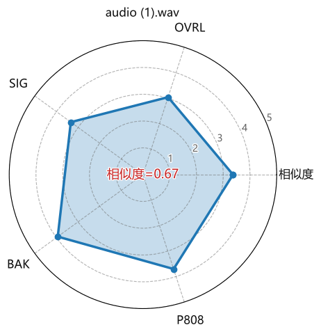

# 🎤 克隆音频综合评估工具

> 一键评估 AI 克隆音频的音色相似度 + 多维度自然度 (DNSMOS)，生成雷达图与评级报告。

[](https://www.python.org/)
[](https://gradio.app/)
[](LICENSE)

---

## 📌 项目简介

本工具用于**评估 AI 克隆语音（如 GPT-SoVITS、RVC 等）与原始参考人声的相似度**，并给出**多维度自然度评分**。它整合了：

- **音色相似度**：基于 Resemblyzer 提取说话人嵌入向量的余弦相似度
- **自然度 / 音质**：DNSMOS 四项指标（OVRL、SIG、BAK、P808）
- **雷达图可视化**：直观对比各项得分
- **评级系统**：每项指标自动挂载 A/B/C/D/E 评级
- **暗色/亮色双主题**：自适应 Gradio 主题

**适用场景**：GPT-SoVITS / RVC / Fish-Speech 等 TTS 模型的音色与音质验收、A/B 测试、模型调优参考。

---

## 🖥️ 界面预览



*（请替换为实际截图）*

---

## 🚀 快速开始

### 1. 克隆仓库

```bash
git clone https://github.com/yourname/voice-clone-eval.git
cd voice-clone-eval
```

### 2. 安装依赖

建议使用虚拟环境（venv / conda）：

```bash
pip install -r requirements.txt
```

**requirements.txt 内容**（如果未提供，手动安装以下库）：

```
gradio>=6.0.0
numpy>=1.24.0
pandas>=2.0.0
matplotlib>=3.7.0
resemblyzer>=0.1.4
speechmos>=0.0.1.1
onnxruntime>=1.15.0
```

> ⚠️ **注意**：`speechmos` 需要 `onnxruntime` 支持，请确保安装。

### 3. 运行

```bash
python eval_voice_multi.py
```

浏览器自动打开 `http://127.0.0.1:7860`。

---

## 📊 指标解读

| 指标 | 评级 | 官方表述（科学） | 人话表述 |
| :--- | :--- | :--- | :--- |
| **相似度** | A~E | 说话人嵌入向量的余弦相似度 | 克隆音色和原声主人像不像？ |
| **OVRL** | A~E | DNSMOS 总体质量评分 | 整体听感舒不舒服？ |
| **SIG** | A~E | DNSMOS 语音信号评分 | 人声清不清晰？ |
| **BAK** | A~E | DNSMOS 背景噪声评分 | 背景干不干净？ |
| **P808** | A~E | ITU-T P.808 标准 MOS 分 | 普通人听着像真人吗？ |

### 评级标准

| 等级 | 相似度 | MOS (OVRL/SIG/BAK/P808) |
| :--- | :--- | :--- |
| **A（优秀）** | ≥ 0.90 | ≥ 4.0 |
| **B（良好）** | ≥ 0.80 | ≥ 3.5 |
| **C（及格）** | ≥ 0.70 | ≥ 3.0 |
| **D（较差）** | ≥ 0.60 | ≥ 2.5 |
| **E（很差）** | < 0.60 | < 2.5 |

---

## 🧪 使用步骤

1. **上传参考音频**：原始人声（.wav / .mp3 / .flac / .ogg），3~10 秒为佳。
2. **上传待测音频**：可按住 `Ctrl` 或 `Shift` 多选多个克隆音频。
3. 点击 **“开始评估”**。
4. 查看结果：
   - **表格**：每个文件的各项得分 + 评级（如 `0.9333-A`）
   - **雷达图**：直观对比每个文件的多维表现

---

## 🔧 常见问题 (FAQ)

### Q1：安装 `speechmos` 时报错找不到 `onnxruntime`？

```bash
pip install onnxruntime
```

### Q2：雷达图中的中文显示为方框？

脚本已内置微软雅黑路径（`C:\Windows\Fonts\msyh.ttc`），如果您的系统没有该字体，请安装或修改 `FONT_PATH` 变量为您的系统字体路径。

### Q3：提示 “Could not create share link”？

这是 Gradio 公网分享功能需要下载 `frpc` 文件。可忽略，本地访问不受影响。如需公网链接，请手动下载 `frpc_windows_amd64_v0.3` 并放入 `~/.cache/huggingface/gradio/frpc/` 目录。

### Q4：评估结果中的 "Error-ERR" 是什么？

表示该项指标计算失败（可能音频格式异常或 DNSMOS 模型加载失败）。请检查音频文件是否为 16kHz 单声道 WAV，或尝试重新采样后再次评估。

### Q5：如何调整评级阈值？

在 `eval_voice_multi.py` 中修改 `get_sim_rank()` 和 `get_mos_rank()` 函数的阈值即可。

---

## 📁 项目结构

```
.
├── eval_voice_multi.py    # 主程序
├── requirements.txt       # 依赖列表
├── README.md              # 项目文档
├── LICENSE                # MIT License
└── screenshot.png         # 界面截图（可替换）
```

---

## 📝 版本规则

- `v2.1`：稳定版，支持双主题、评级系统、持久图片
- 版本号格式：`主版本.次版本字母`
- 数字部分变动 → 字母重置为 `a`（如 `v2.1` → `v2.2a`）
- 仅修复 Bug → 字母递增（如 `v2.1b` → `v2.1c`）

---

## 🤝 贡献

欢迎提 Issue 或 PR！如果觉得有用，请点亮 ⭐。

---

## 📄 许可证

[MIT License](LICENSE)

---

## 🙏 致谢

- [Resemblyzer](https://github.com/resemble-ai/Resemblyzer) — 说话人嵌入提取
- [DNSMOS](https://github.com/microsoft/DNS-Challenge) — 多维度语音质量评估
- [Gradio](https://gradio.app/) — Web UI 框架

---

## 📧 联系

如有问题，请提 [Issue](https://github.com/yourname/voice-clone-eval/issues) 或邮件联系。
